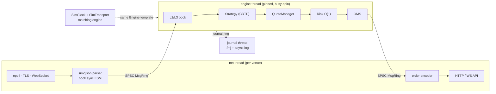

# FastMM

**An open-source, ultra-low-latency market-making engine in C++20.**
One engine thread owns all trading state, every input is journaled, and the same template code
runs live, in simulation, and in deterministic replay. Crypto venues (Binance, Bybit, Deribit) ship today;
the abstractions are built for equities, futures, options and FX (FIX 4.4, ITCH/OUCH, CME MDP3 SBE).

[](.github/workflows/ci.yml)


> **Status: v0.1.** The core engine, networking stack, simulator, backtester, Binance Spot (testnet
> and Demo Mode), Bybit v5 and Deribit options and futures testnet connectors, a Binance-compatible
> simulated exchange with end-to-end tests, and the Python research bindings are implemented and
> tested. Testnets are the default. Nothing here is
> investment advice. Live trading is at your own risk.

## Latency

Measured on an 8-core desktop under WSL2, gcc 13.3, `-O3 -march=native` with LTO, pinned to
one core, median of 5 runs. Full table and methodology: [`bench/README.md`](bench/README.md).

| Hot-path operation | Median |
|---|---:|
| L2 book: change the quantity of one of the top 4 levels | 2.0 ns |
| Pre-trade risk check (15 checks) | 8.1 ns |
| OMS submit → ack → fill lifecycle | 91.7 ns |
| SPSC ping-pong between two cores (round trip, two hops) | 129.4 ns |
| Tick-to-order in simulation (book delta in → order serialized, ticks that sent orders) | 639.0 ns |
| Binance depth diff JSON → normalized event (20 levels) | 630.1 ns |

## Architecture



- **No allocation, no exceptions, no virtual calls on the hot path.** Enforced by a test binary that
  replaces global `operator new` and fails on any allocation inside hot-path scopes.
- **Exact fixed-point money.** `Price`, `Qty` and `Notional` are strong `int64` types with a 1e-8
  scale; decimal strings from venues parse exactly and products go through `__int128`.
- **Determinism.** Clock, transport and event feed are compile-time policies. `fastmm-replay` runs
  a recorded journal back through the engine and verifies the outbound order stream is byte-identical.
- **Measured, not claimed.** `rdtscp` stamps at six hops feed allocation-free log-linear histograms;
  every hot component has a Google Benchmark with a p50 budget checked by `tools/check_budgets.py`.

Details: [Architecture](docs/explanation/architecture.md), [Event flow](docs/explanation/event-flow.md),
[Determinism](docs/explanation/determinism.md) and the design records in [`docs/adr/`](docs/adr).
All documentation starts at [`docs/README.md`](docs/README.md).

## Quick start

Requirements: gcc 13+ or clang 16+, CMake 3.25+, Ninja, OpenSSL 3 and zlib headers. All other
dependencies are fetched and pinned by CPM.

```bash
git clone https://github.com/ziyangliu-666/FastMM && cd FastMM
./scripts/bootstrap.sh                                   # checks toolchain, configures the release preset
cmake --build --preset release -j && ctest --preset release
./build/release/bin/fastmm-backtest --config configs/backtest-example.toml --data synthetic
./scripts/run-sim.sh --duration 30s                      # sim exchange + live engine on localhost
./build/release/bin/fastmm-top --name sim-local           # live dashboard, in another terminal
```

Or without a local toolchain: `docker compose up --build` starts the simulated exchange and the
engine in two containers. The simulator and its fault injection are described in
[Simulated exchange](docs/reference/sim-exchange.md). [Install](docs/getting-started/install.md) has
the details, and the [Quick start](docs/getting-started/quickstart.md) backtests your own strategy
in under 30 lines.

Python research bindings, in a virtual environment:

```bash
python -m venv .venv && . .venv/bin/activate
pip install -e ".[dev]" && pytest python/tests
python examples/python/backtest_quickstart.py
```

## What's inside

| Component | Where | Highlights |
|---|---|---|
| Core engine | `include/fastmm/core` | `Engine<Strategy, Clock, Transport, Feed>`, sorted-array L2 book, tick-indexed L3 book, OMS state machine with exchange-race handling, O(1) risk, quote manager with hysteresis |
| Messaging | `core/msg_ring.hpp`, `core/journal.hpp` | variable-length SPSC ring, `.fmj` append-only journal with CRC32C blocks |
| Networking | `include/fastmm/net` | hand-written reactor on epoll or io_uring (`[engine] net_backend`), OpenSSL BIO-pair TLS, RFC 6455 WebSocket, HTTP/1.1, reconnect FSM with make-before-break |
| Venues | `include/fastmm/venues` | Binance Spot (testnet and Demo Mode), Bybit v5 and Deribit (options and futures over JSON-RPC, with `OptionTicker` events) connectors, snapshot + delta sync, HMAC/Ed25519 auth, rate limiting, reject backoff ([connectors](docs/reference/venues.md), [options](docs/reference/options.md)) |
| Codecs | `include/fastmm/codecs` | FIX 4.4 session and codec, Nasdaq ITCH 5.0 / MoldUDP64 / SoupBinTCP / OUCH 4.2 and 5.0, CME MDP 3.0 SBE with A/B arbitration; each checked against the matching engine ([FIX](docs/reference/codecs/fix.md), [Nasdaq](docs/reference/codecs/nasdaq.md), [CME](docs/reference/codecs/cme-mdp3.md)) |
| Monitoring | `apps/fastmm-top` | terminal dashboard over a shared-memory status file: engine counters, PnL, latency percentiles, venue channels |
| Simulation | `include/fastmm/sim` | price-time matching engine, seeded latency model, queue-position fill model, synthetic order flow |
| Sim exchange | `apps/fastmm-sim-exchange` | Binance-compatible REST, market-data WebSocket, WS API and user stream over TCP or TLS, with fault injection (disconnects, dropped diffs, delayed acks, clock skew) |
| Backtesting | `include/fastmm/backtest` | journal / CSV / numpy sources, fees, PnL, Sharpe, drawdown, parameter sweeps |
| Strategies | `include/fastmm/strategies` | BasicMM with inventory skew, Avellaneda-Stoikov, OptionsMM (Black-76, delta and vega limits) |
| Python | `python/` | `fastmm.run_backtest`, `fastmm.sweep`, zero-copy numpy in and out, strategies written in Python ([API](docs/reference/python-api.md)) |

## Extending

**Add a strategy** in one header: implement the hooks you need, declare parameters with
`FASTMM_PARAM`, register it with one call for backtests, replay and live trading. The engine checks
hook signatures at compile time (a wrong one is a readable build error) and a registered strategy
that was never compiled is a link error. Start with the
[Quick start](docs/getting-started/quickstart.md) and the tutorial
[Your first market maker](docs/tutorials/first-strategy/README.md) (from a header to the simulated
exchange and Binance Demo); look things up in the [Strategy API](docs/reference/strategy-api.md).
Your own project on an installed FastMM: [`examples/external-project/`](examples/external-project/).
The whole strategy of the quick start (`examples/quickstart/my_mm.hpp`, compiled and run in CI):

<!-- snippet: examples/quickstart/my_mm.hpp#strategy -->
```cpp
#include "fastmm/strategy.hpp"

using namespace fastmm;

struct MyParams {
  FASTMM_PARAMS(MyParams)
  FASTMM_PARAM_BPS(half_spread_bps, 0.005_bps, 0_bps, 1000_bps, "half spread around the mid, bps")
  FASTMM_PARAM(Qty, quote_qty, 0.001_qty, 0_qty, 1000_qty, "quantity per side, base units")
};

struct MyMM : StrategyBase<MyParams> {
  static constexpr std::string_view name() noexcept { return "my_mm"; }

  void on_book(auto& ctx, InstrumentId id, const auto& book) noexcept {
    if (!book.is_valid()) return ctx.pull_quotes(id);  // empty or crossed
    const Instrument& inst = ctx.instrument(id);
    const Price half = book.mid() * params().half_spread_bps;  // exact integer arithmetic
    DesiredQuotes q;
    q.bid(inst.round_price(book.mid() - half, Side::Buy), inst.round_qty(params().quote_qty));
    q.ask(inst.round_price(book.mid() + half, Side::Sell), inst.round_qty(params().quote_qty));
    ctx.set_quotes(id, q);  // the engine sends only the difference to the resting orders
  }
};
```

**Add a venue** with a market-data parser, an order gateway and a control-path class; binary
protocols plug in as `Framer` / `Decoder` / `Encoder` codecs on the same connection stack.
Walkthrough, with a conformance checklist: [`docs/how-to/venues/add-a-venue.md`](docs/how-to/venues/add-a-venue.md).

## Operating

Before trading on a testnet or Binance Demo, read the operator guides:

- [Run on a testnet or Binance Demo](docs/how-to/operations/run-on-testnet.md): keys, endpoints, `--dry-run`, a first keyed session
- [Go-live checklist](docs/how-to/operations/go-live-checklist.md)
- [Kill switch and shutdown](docs/how-to/operations/kill-switch-and-shutdown.md): what trips it and how to read `cancel_all ok|FAILED`
- [Journals, replay and PnL](docs/how-to/operations/journals-replay-pnl.md): `tools/pnl_report.py` and account reconciliation
- [Troubleshooting](docs/how-to/operations/troubleshooting.md), keyed by log message
- [Monitoring a live session](docs/how-to/operations/monitor-with-fastmm-top.md) with `fastmm-top`

## Testing

```bash
ctest --preset release                 # unit, property, fixture, replay, integration, no-alloc, bench smoke
cmake --workflow --preset asan         # AddressSanitizer + UBSan
cmake --workflow --preset tsan         # ThreadSanitizer
./scripts/bench.sh --preset release-native --cpu 2
```

Order books and the matching engine are property-tested against naive reference models over
hundreds of seeded random operation sequences. Venue parsers are tested against recorded messages.
CI runs gcc and clang, release and sanitizer builds, lint, and the Python wheel.

## Roadmap

- [x] Core engine, journal, risk, OMS, strategies
- [x] Networking stack (TLS, WebSocket, HTTP)
- [x] Matching engine, backtester, deterministic replay
- [x] Binance Spot and Bybit v5 testnet connectors, `fastmm-live`
- [x] Python research bindings (backtests, sweeps, zero-copy numpy)
- [x] Python strategies in backtests (`fastmm.Strategy`, bit-identical BasicMM port)
- [x] Binance-compatible simulated exchange with fault injection and end-to-end tests
- [ ] Python package on PyPI (wheels build in CI; publishing is a manual step)
- [x] FIX 4.4 session and codec, Nasdaq ITCH 5.0 / MoldUDP64 / SoupBinTCP / OUCH 4.2 and 5.0
- [x] CME MDP 3.0 SBE codec with A/B arbitration and snapshot recovery
- [x] Deribit options connector with Black-76 greeks-aware quoting (`options_mm`)
- [x] Terminal monitoring UI (`fastmm-top`)
- [x] io_uring reactor backend (`net_backend = "io_uring"`)
- [ ] Kernel-bypass transports

## License

MIT. See [`LICENSE`](LICENSE). Built with [fmt](https://github.com/fmtlib/fmt),
[simdjson](https://github.com/simdjson/simdjson), [toml++](https://github.com/marzer/tomlplusplus),
[doctest](https://github.com/doctest/doctest), [Google Benchmark](https://github.com/google/benchmark),
[pybind11](https://github.com/pybind/pybind11) and [CPM.cmake](https://github.com/cpm-cmake/CPM.cmake).
