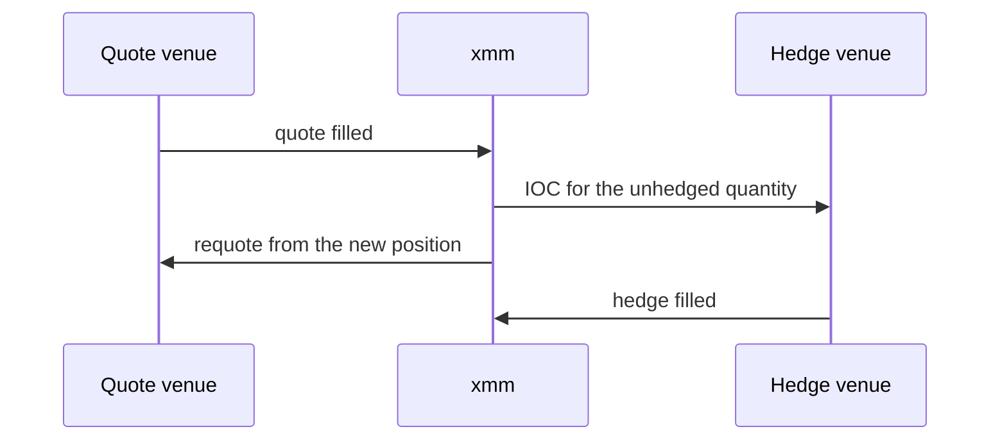
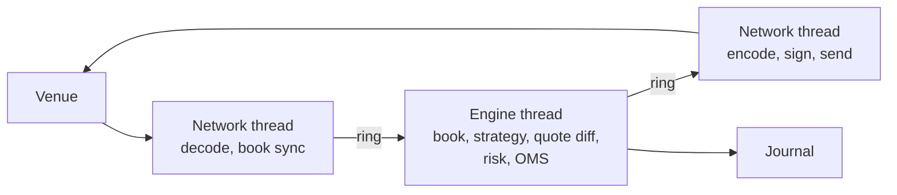

# FastMM

[](https://github.com/ziyangliu-666/FastMM/actions/workflows/ci.yml)
[](https://ziy.bio/FastMM/)
[](https://pypi.org/project/fastmm-engine/)
[](LICENSE)

FastMM is a low-latency market-making engine in C++20: it quotes on one venue and hedges every fill on another, with strategies in C++ or Python.

- `xmm` quotes one instrument and hedges each fill with an IOC on a second venue. `basic_mm`, `avellaneda_stoikov`, `options_mm` and `lead_mm` ship beside it.
- One engine thread owns the books, orders and positions. It takes no locks and allocates nothing after start-up; Python hooks are compiled with Numba and run on that thread without the GIL.
- `fastmm-gateway` holds the venue connections, so several strategy processes share one account and one can crash and restart while the others keep trading.
- A restarted session replays the venue's executions and reconciles before it sends an order. Every session is journaled, and replaying the journal sends the same orders byte for byte.

## Quickstart

With the wheel (Linux x86-64, CPython 3.10+), no keys and no build:

```bash
pip install "fastmm-engine[hot]"
fastmm init my-mm && cd my-mm
python backtest.py
```

`fastmm init` writes a strategy, a config for a simulated market and a backtest that prints PnL, fills and markouts. For a day of real Binance data, run `python -m fastmm.data fetch --symbol BTCUSDT --date 2024-03-27` ([Backtest on real data](docs/how-to/backtesting/binance-public-data.md)).

From source, the live engine against a local exchange that speaks Binance's API:

```bash
git clone https://github.com/ziyangliu-666/FastMM && cd FastMM
cmake --preset release && cmake --build --preset release -j
./scripts/run-sim.sh --duration 30s
```

The build needs gcc 13+ or clang 16+, CMake 3.25+, Ninja and OpenSSL 3. Releases also ship as a tarball and as `ghcr.io/ziyangliu-666/fastmm` ([Deploy a release](docs/how-to/operations/deploy.md)).

## Write a strategy

A strategy says which quotes it wants. The engine diffs them against the resting orders, checks risk and sends the difference.

<!-- snippet: examples/python/strategies/touch_mm.py#example -->
```python
import fastmm
from fastmm import Param


class TouchMM(fastmm.Strategy):
    half_spread_bps = Param(0.01, min=0.0, doc="half spread around the mid, bps")
    quote_qty = Param(0.002, min=0.0, doc="size per side, base units")

    @fastmm.hot  # compiled with Numba, called on the engine thread without the GIL
    def on_book(self, ctx, book):
        if not book.valid:
            ctx.pull()
            return
        half = book.mid * self.half_spread_bps * 1e-4
        ctx.clear()
        ctx.bid(book.mid - half, self.quote_qty)
        ctx.ask(book.mid + half, self.quote_qty)
        ctx.keep_passive()  # leave a resting order alone while its price is still right


cfg = fastmm.BacktestConfig.from_toml("configs/backtest-example.toml")
cfg.params = {}  # the file's [strategy.params] are basic_mm's
result = fastmm.run_backtest(cfg, data="synthetic", strategy=TouchMM)
print(result.summary_table())
```

The same quoter in C++ is [`examples/quickstart/my_mm.hpp`](examples/quickstart/my_mm.hpp). The [tutorial](docs/tutorials/first-strategy/README.md) takes a C++ strategy from its header to Binance Demo.

## Quote on one venue, hedge on another

`xmm` prices its quotes from the hedge venue's mid, plus both venues' fees and an edge. When a quote fills, the hedge goes out in the same engine step:


```mermaid
sequenceDiagram
    participant Q as Quote venue
    participant X as xmm
    participant H as Hedge venue
    Q->>X: quote filled
    X->>H: IOC for the unhedged quantity
    X->>Q: requote from the new position
    H->>X: hedge filled
```

Hedges follow positions, not fill counts, so a restart, a replayed execution or a late fill never hedges twice. `configs/xmm-binance-demo.toml` quotes Binance Spot and hedges on Binance USDⓈ-M; it has run on Binance Demo behind `fastmm-gateway` through `kill -9` of the strategy mid-hedge and of the gateway, checked against the venue's own records ([Run xmm](docs/how-to/strategies/xmm.md)).

## Venues

| Venue | Markets | Orders | Environment |
|---|---|---|---|
| Binance Spot | spot | WebSocket API | Binance Demo, Spot testnet |
| Binance USDⓈ-M | perpetuals | WebSocket API | Binance Demo |
| Bybit v5 | spot, linear perpetuals | WebSocket | Bybit testnet |
| OKX v5 | spot, USDT swaps | WebSocket | OKX Demo |
| Deribit | options, futures | WebSocket | Deribit testnet |
| Gemini | spot, perpetuals | WebSocket | Gemini sandbox |
| Coinbase Advanced Trade | spot | REST | production |
| Coinbase Exchange | spot | REST | Coinbase Exchange sandbox |

Nasdaq TotalView-ITCH is supported as well: MoldUDP64 multicast market data, with OUCH 5.0 order entry against the bundled `fastmm-sim-itch`. [Add a venue](docs/how-to/venues/add-a-venue.md) from your own project without changing FastMM.

## How it works


```mermaid
flowchart LR
    V[Venue] --> N[Network thread<br/>decode, book sync]
    N -- ring --> E[Engine thread<br/>book, strategy, quote diff,<br/>risk, OMS]
    E -- ring --> O[Network thread<br/>encode, sign, send]
    O --> V
    E --> J[Journal]
```

Each venue has its own network thread, joined to the engine thread by single-producer rings. The engine records every event in the journal before it acts on it. Backtests, replays and live sessions run the same `Engine` template with a different clock, feed and transport ([How FastMM works](docs/explanation/how-it-works.md), [Benchmarks](docs/explanation/benchmarks.md)).

## Documentation

<https://ziy.bio/FastMM/>: [quickstart](docs/getting-started/quickstart.md), [Binance Demo and testnets](docs/how-to/operations/run-on-testnet.md), [run in production](docs/how-to/operations/running-in-production.md), [configuration](docs/reference/configuration.md).

## License

[MIT](LICENSE)
