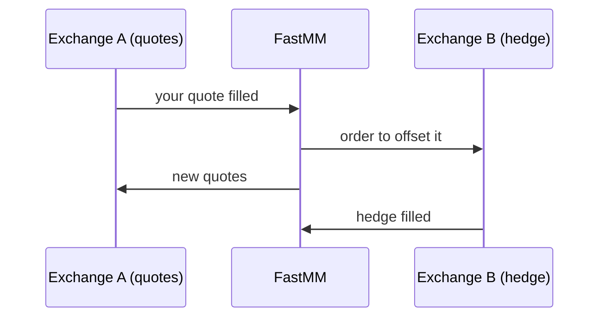
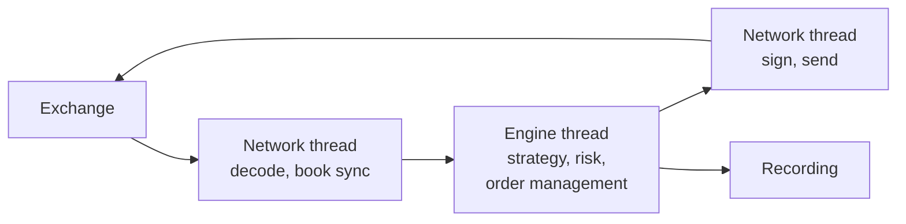

# FastMM

[](https://github.com/ziyangliu-666/FastMM/actions/workflows/ci.yml)
[](https://ziy.bio/FastMM/)
[](https://pypi.org/project/fastmm-engine/)
[](LICENSE)

FastMM is an open-source engine for running market-making strategies on crypto exchanges. You write the quoting logic in Python or C++; FastMM connects to the exchanges, keeps your orders in sync with them, checks risk, and picks up where it left off after a crash or a dropped connection.

A market maker keeps a buy order just below the market price and a sell order just above it, and earns the difference when both fill. Doing that well means reacting to every price change within microseconds and always knowing which orders are live, which have filled, and what you hold. FastMM takes care of those parts, so a strategy only has to decide where to quote.

The same strategy code runs in a backtest on recorded market data, against a simulated exchange, and live.

## Quickstart

The quickest way to try it is the Python package, on Linux x86-64 with Python 3.10 or newer. It runs a backtest on a simulated market, with no exchange account and no API keys:

```bash
pip install "fastmm-engine[hot]"
fastmm init my-mm && cd my-mm
python backtest.py
```

`fastmm init` creates `strategy.py`, `config.toml` and `backtest.py`. The backtest trades two minutes of simulated market and prints a summary that starts like this:

```text
backtest py:MyMm  seed=1  md_events=43735  steps=47181  wall=0.02s
  net pnl                        -100.1066
  realized / unrealized / fees   0.0688 / 0.0003 / 100.1757
  fills (maker / taker)          952 (952 / 0)
  time to fill p50/p90/p99       26.1 / 96.3 / 335.1 ms
```

The strategy earns a little on each fill, and the exchange fee of 0.10% a trade takes more than that. `python backtest.py --sweep half_spread_bps=0.005,0.01,0.02,0.05` runs it again at four spreads so you can see how the width of the quotes changes the result. To backtest on a day of real Binance data, see [Backtest on real data](docs/how-to/backtesting/binance-public-data.md).

## Write a strategy

A strategy describes the quotes it wants, and FastMM works out which orders to place, move or cancel to get there. This one keeps a bid and an ask at a fixed distance from the mid, the price halfway between the best bid and the best ask. The distance is in basis points (1 bp = 0.01%):

<!-- snippet: examples/python/strategies/touch_mm.py#example -->
```python
import fastmm
from fastmm import Param


class TouchMM(fastmm.Strategy):
    half_spread_bps = Param(0.01, min=0.0, doc="distance of each quote from the mid, bps")
    quote_qty = Param(0.002, min=0.0, doc="size per side, base units")

    @fastmm.hot  # compiled to machine code with Numba
    def on_book(self, ctx, book):
        if not book.valid:
            ctx.pull()
            return
        half = book.mid * self.half_spread_bps * 1e-4
        ctx.clear()
        ctx.bid(book.mid - half, self.quote_qty)
        ctx.ask(book.mid + half, self.quote_qty)
        ctx.keep_passive()  # leave an order in place while its price is still right
```

`on_book` runs on every change to the order book. When the book can't be trusted, for example while it reconnects, the strategy pulls its quotes; otherwise it asks for one bid and one ask. Before any order goes out, FastMM checks it against your risk limits and the balance you hold on that exchange. [Write a Python strategy](docs/how-to/strategies/python-live.md) goes further, and the [tutorial](docs/tutorials/first-strategy/README.md) builds the same kind of strategy in C++ and takes it to a demo account.

## Exchanges

When a strategy works in backtests, the next step is an exchange's test environment, where it trades with fake money against the exchange's real systems. These are the exchanges FastMM trades on, and where you can test each one:

| Exchange | Markets | Test environment |
|---|---|---|
| Binance | spot, perpetual futures | Binance Demo |
| OKX | spot, perpetual futures | OKX Demo |
| Bybit | spot, perpetual futures | Bybit testnet |
| Deribit | options, futures | Deribit testnet |
| Gemini | spot, perpetual futures | Gemini sandbox |
| Coinbase Advanced Trade | spot | none (production only) |
| Coinbase Exchange | spot | Coinbase Exchange sandbox |

[Run on a testnet or Binance Demo](docs/how-to/operations/run-on-testnet.md) walks through the keys, a dry run and a first session. To support another exchange, you can [add a venue](docs/how-to/venues/add-a-venue.md) from your own project.

## Quote on one exchange, hedge on another

With more than one exchange connected, a strategy can avoid holding a position at all. It quotes on one exchange and, whenever a quote fills, takes the opposite side right away on a second exchange where trading is cheaper. FastMM ships a strategy that does this, `xmm`:


```mermaid
sequenceDiagram
    participant Q as Exchange A (quotes)
    participant X as FastMM
    participant H as Exchange B (hedge)
    Q->>X: your quote filled
    X->>H: order to offset it
    X->>Q: new quotes
    H->>X: hedge filled
```

The hedge is sized from what you hold rather than from a count of fills, so a restart or a delayed message does not hedge the same fill twice. You can give it a backup exchange for when the first one is down or refuses the order, and have it reduce the position step by step if no exchange can take the hedge. Your own strategies can use the same hedging logic ([Hedge with HedgeExecutor](docs/how-to/strategies/hedge-executor.md), [Run xmm](docs/how-to/strategies/xmm.md)).

## Running it for real

Several strategies can share one exchange account through `fastmm-gateway`, which holds the connections. One strategy can crash and restart while the others keep trading, and account-wide limits on position and loss apply across all of them. Every session is recorded, and replaying a recording sends the same orders again, so any past decision can be examined step by step. [Run in production](docs/how-to/operations/running-in-production.md) and [the runbook](docs/how-to/operations/runbook.md) cover deployment, monitoring and what to do when something goes wrong.

## How it works

For each exchange, a network thread decodes messages and keeps the order book in sync. A single engine thread runs the strategy, the risk checks and order management, and hands orders back to the network thread to send. The threads pass messages through lock-free queues, and the engine thread never waits on the network or allocates memory while trading.


```mermaid
flowchart LR
    V[Exchange] --> N[Network thread<br/>decode, book sync]
    N --> E[Engine thread<br/>strategy, risk,<br/>order management]
    E --> O[Network thread<br/>sign, send]
    O --> V
    E --> J[Recording]
```

Building from source gives you the C++ programs, including the live engine and a local exchange simulator (gcc 13+ or clang 16+, CMake 3.25+, Ninja, OpenSSL 3):

```bash
git clone https://github.com/ziyangliu-666/FastMM && cd FastMM
cmake --preset release && cmake --build --preset release -j
./scripts/run-sim.sh --duration 30s
```

[How FastMM works](docs/explanation/how-it-works.md) explains the design, and [Benchmarks](docs/explanation/benchmarks.md) has the latency measurements.

## Documentation

The full documentation is at <https://ziy.bio/FastMM/>.

## License

[MIT](LICENSE)
